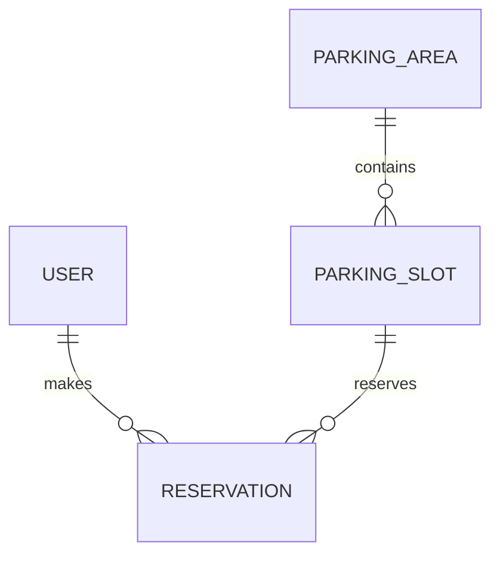
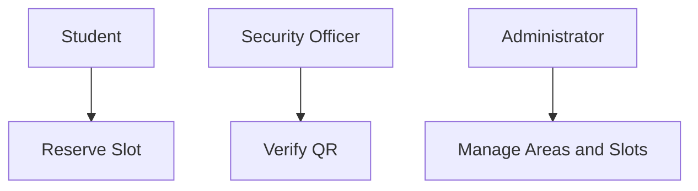
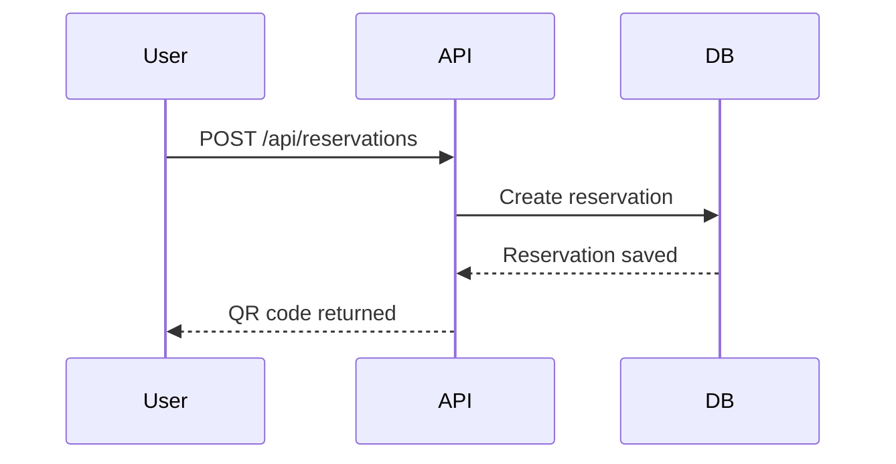

# Architecture Documentation

## ER Diagram

```mermaid
erDiagram
  USER ||--o{ RESERVATION : makes
  PARKING_AREA ||--o{ PARKING_SLOT : contains
  PARKING_SLOT ||--o{ RESERVATION : reserves
```

## Use Case Diagram

```mermaid
flowchart TD
  A[Student] --> B[Reserve Slot]
  C[Security Officer] --> D[Verify QR]
  E[Administrator] --> F[Manage Areas and Slots]
```

## Sequence Diagram

```mermaid
sequenceDiagram
  participant User
  participant API
  participant DB
  User->>API: POST /api/reservations
  API->>DB: Create reservation
  DB-->>API: Reservation saved
  API-->>User: QR code returned
```
